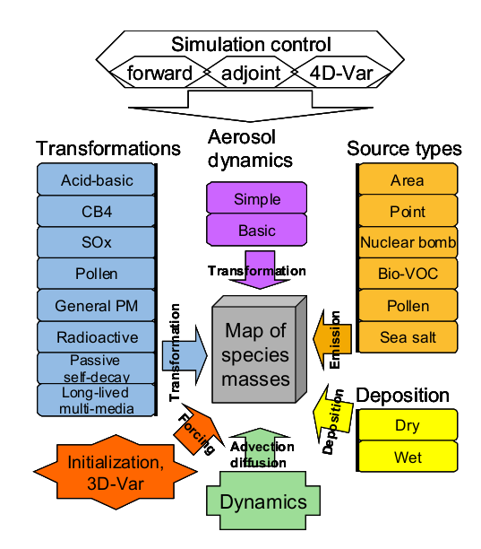
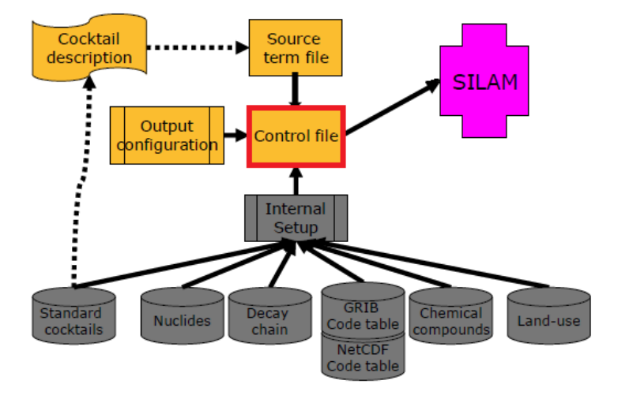

<!--# Silam v5 - User Guide-->

<!--  TOC -->

# 1 Substances and their transformation in SILAM

<!--what SILAM does in one sencentence -->
SILAM is capable of computation of dispersion of hundreds of different atmospherical chemical species or nuclides together with their properties and transformations as well as inert or chemicaly active size-specific aerosol, biological material (pollen grains), among others. 

<!-- Rami: I think this figure could be updated! -->


**Fig. 1.** Structure of SILAM.

The principles implemented in the model enable handling of virtually any species with any types of interactions between them. A single specie or a mixture of species transported in air is called *cocktail*. 
<!-- Rami: maybe an image or example to ilustrate what a cocktail is? -->

Each cocktail has specific species and characteristics regarding its composition. The chemical and physical transformations that a cocktail can endure are:

| Transformation | Description | Emissions requested |
|----------------|--------------------------------------------------------|--------------------|
| `PASSIVE`      | used on source-sensitivity computations (*backwards* mode) |	               |
| `POLLEN`       | transport and deposition of pollen grains              |	               |
| `PM_GENERAL`   | transport & deposition (no chemistry involved)         | PM                 |
| `DMAT_SULPHUR` | linear chemistry for SO2 / SO4, transport & deposition.| SOx                |
| `ACID_BASIC`   | inorganic chemistry, transport & deposition.           | CO, NOx, SOx & NH3 |
| `CB5_SOA`      | inorganic & organic chemistry, transport & deposition. | CO, NMVOC & NOx    |
| `RADIOACTIVE`  | radioactive, transport & deposition features.          |                    |

<!-- I would include also the aerosol dynamic options supported.. 
Diferent dynamics for aerosols have been also implemented:
| Transformation      | Description                       |
|.....................|...................................|
| `NONE`              |                                   |
| `SIMPLE`            |                                   |
| `MIDDLE_ATMOSPHERE` |                                   |
| `VBS`               |                                   |
-->

# 2 Outline of the initialization/configuration files
SILAM may have up to ten input files depending on the complexity of the setup.

<!--  -->
```Haskell
       control file 
       ├── general_parameters
       │
       ├── emission_parameters
       │   └── emission_source file/s
       │
       ├── dispersion_parameters
       │
       ├── meteo_parameters
       │
       ├── transformation_parameters
       │
       ├── initial_and_boundary_conditions
       │   └── boundary_header_filename
       │
       ├── optical_density_parameters
       │
       ├── output_parameters            
       │   └── variable_list (output configuration file)
       │   
       └── standard_setup
           ├── standard_cocktail_fnm
           ├── grib_code_table_fnm   
           ├── netcdf_name_table_fnm
           ├── *chemical_database_fnm
           ├── *nuclide_database_fnm
           ├── *optical_properties_meta_data_file
           ├── *photolysis_data_file
           └── *timezone_list_fnm
```
**Fig. 2.** Structure of SILAM configuration files^[files with `*` are not mandatory for every run.].


The *mandatory files* for any run configuration are:

- **control file:** general user-defined parameters of the run.
- **source term file:** describes the emission sources.
- **standard cocktails file:** defines the standard cocktails that can be used in the source description^[Users are free to create their own cocktails, adding to the existent file.].
- **GRIB or NetCDF name tables**: definitions for handle files, invisible for users.
- **output configuration file:** describes the output setup.

Depending of the configuration of the run, there are other files that also should be included in the *standard setup configuration*, for example:

- **nuclide data file:** for radioactive simulations.
- **optical properties:** for chemical and aerosol simulation, describes the optical properties of substances.
- **chemical properties:** describes the chemical properties of the species available in SILAM.
- **photolysis data file:** describes photolysis rates for photochemical reactions.

> Files included on the *standard setup* **should NOT be altered**: their modification may lead to model malfunction (any further modifications by the user are at their own risk). 

The structure of the mandatory files will be described in this document. 


## 2.1 General rules for the configuration files:

Configuration files are ASCII files, lines are *case-sensitive* and trailing blanks are ignored. Empty lines and commented lines are ignored. All characters after signs `#` or `!` are considered as comments^[Sign `#` always starts comments, while sign `!` starts comments ONLY if it is placed at the beginning of line or preceded by the empty space.].


A single file can include a group of *namelists*, placed one-by-one in arbitrary order. Each namelist starts from the line `LIST = <namelist_name>` and ends with the line `END_LIST = <namelist_name>`^[the blank spaces around the `=` character are mandatory]. 

```
LIST <namelist_name>

	<item_name1> = <item1_value>
	<item_name2> = <item2_value>
        ...
	<item_nameN> = <itemN_value>

END_LIST <namelist_name>
```

where `<namelist_name>` must be specific keys that are understood by the model.

The namelist content is placed between the `LIST` and `END_LIST` lines with the following format:`<item_name> = <item_value>` ^[the blank spaces around the `=` character are mandatory]. 
The `<item_name>` must be understood by the model as well and the `<item_value>` format and its meaning fully depends on the `<item_name>` itself. The `<item_value>` may vary from a single number to a complicated line with several space-separated fields. **The order of the namelist lines is arbitrary** and unnecessary lines or lines with unknown `<item_name>` will be skipped by the model.


When paths to files are requested as an `<item_value>`, templates for dates and time has been created to allow the user to specify dynamic (date-time changing) paths to files.
 
> Example: `/path/to/data/myfile%ay4%am2%ad2%ah2%f2: where `/path/to/data/` is the `path` to the files and `myfile%ay4%am2%ad2%ah2%f2` is the file name itself. The name depends on the analysis time and forecast length of the fields stored in it.

Templates pointing to the analysis time (not allowed for the output files):

| syntax  | description | example |
|---------|-----------------------------------------|---------|
| `%ay4`  | 4-digit year   of the analysis time     |  *2002* |
| `%am2`  | 2-digit month  of the analysis time     |  *01*   | 
| `%ad2%` | 2-digit day    of the analysis time     |  *05*   |
| `%ah2`  | 2-digit hour   of the analysis time     |  *07*   |
| `%f2`   | 2-digit number of hours of the forecast |  *015*  |

**More about templates:**

Analysis time, Forecast base time or first guess verification time (all usually at synoptic hours: 00, 06, 12 and 18). Templates pointing to the analysis time:

| syntax  | description | example |
|------------------------|---------------------------------------------------------------|--------------------|
| `%ay2`, `%ay4`         | 2 and 4-digit year of the analysis time.                      | *02* or *2002*     |
| `%am1`, `%am2`, `%amc` | 1 to 2-digit; 2-digit; 3-character month of the analysis time.| *1*; *01* or *JAN* |
| `%ad1`, `%ad2%`        | 1 to 2-digit; 2-digit day of the analysis time.               | *5*; *05*          |
| `%ah1`, `%ah2`, `%ah3` | 1, 2 or 3; 2 to 3; 3-digit hour of the analysis time.         | *7*; *07*; *007*   |
| `%an2`,                | 2-digit minutes of the analysis time.                         | *15*               |
| `%f2 `, `%f3`          | 2 and 3-digit number of hours of the forecast length.         | *15*; *015*        |

Observation time (any combination in hours and minutes is valid, subject to data availability in the archive). Templates pointing to the valid time of the fields are constructed in the same way but without the *a*, e.g. %y2; %y4: firmly 2 and 4-digit year of the analysis time (e.g. *02* or *2002*).


# 3 Configuration files

## 3.1 Control file
The control file is the main configuration file, where the model set-up is described. This file
will also provide the link between the model and other necessary input files. A control file is
always starting and ending with `CONTROL_V5` and `END_CONTROL_V5`. A control file is a namelist
 group that contains the following namelists:

- `general_parameters             `
- `emission_parameters            `
- `dispersion_parameters          `
- `meteo_parameters               `
- `transformation_parameters      `
- `initial_and_boundary_conditions`
- `optical_density_parameters     `
- `output_parameters              `
- `standard_setup                 `

Below sections describe the `item_names` for each namelist. 

> **\*Note:** Format specifications in this document follows *the C format specifiers* sintax, *strftime standard* (for date/time), and literals are indicated whit `this_font`.

### 3.1.1 `GENERAL_PARAMETERS`

Here we set the name of the run, period of run, time step and type of run:
```
LIST = general_parameters
   case_name    = prueba
   direction_in_time = FORWARD           !FORWARD/INVERSE
   start_time   = 2009 03 15 19 00 00
   end_time     = 2009 03 16 18 00 00
   time_step    = 60                     ![minutos]
   !computed_period = 23 hour
   computation_accuracy = 5
END_LIST = general_parameters
```

| variable               | format/ value      | description                    |
|------------------------|---------------------|-------------------------------|
| `case_name`    	 | *%s*                | name of the run               |
| `direction_in_time`    | `FORWARD`/`INVERSE` | direction in time of the run. |
| `start_time`         	 | *%Y %m %d %H %M %s* | -                             |
| `end_time`             | *%Y %m %d %H %M %s* | -                             |
| `computed_period`      | *%d* `hr/day/mon/yr`| -                             |
| `time_step`            | *%d* `min`          | number of minutes (min)       |
| `computation_accuracy` | *%d*	               | [0..10]                       |

Note that `computed_period` and `end_time` are mutualy exclusive and the latter takes precedence.

### 3.1.2 `EMISSION_PARAMETERS`

This section defines the sources to be considered by the model.

```
LIST = emission_parameters

  emission_source = EULERIAN  emis/dust-simple/src_simple_dust.ini
  cut_area_source_if_outside_meteo_grid = YES

END_LIST = emission_parameters
```

| variable                                | format/ value     | description                            |
|-----------------------------------------|-------------------|----------------------------------------|
| `emission_source`                       | `EULERIAN` *%s*   | path to source file                    |
| `cut_area_source_if_outside_meteo_grid` | `YES`/`NO`        |                                        |


### 3.1.3 `DISPERSION_PARAMETERS`

Mainly grid (horizontal and vertical) definitions and configuration.

```
LIST = dispersion_parameters
  grid_method = OUTPUT_GRID
  vertical_method = OUTPUT_LEVELS

END_LIST = dispersion_parameters
```

| variable             | format/ value     | description                            |
|----------------------|-------------------|----------------------------------------|
| `grid_method`        |  ` METEO_GRID`    | use same grid that the meteo data.     |
|                      |  `OUTPUT_GRID`    | use grid defined in output namelist.   |
|                      |  `CUSTOM_GRID`    | setup customized grid.                 |
|----------------------|-------------------|----------------------------------------|
| `vertical_method`    |  ` METEO_LEVELS`  | use same grid that the meteo data.     |
|                      |  `OUTPUT_LEVELS`  | use grid defined in output namelist.   |
|                      |  `CUSTOM_LEVELS`  | setup customized grid.                 |


**Horizontal grid definitions**^[ All **geographical values are in decimal degrees**.]

When `CUSTOM_GRID` is set the user should set the parameters for the horizontal grid:

| variable     | format    | description                               | 
|--------------|-----------|-------------------------------------------|
| `grid_type`  | `lon_lat` | `lon_lat` is the only grid available.     |             
| `grid_title` | *%s*      | A name for the grid.                      |
| `lon_start`  | *%.5f*    | South-west corner lon value.              | 
| `lat_start`  | *%.4f*    | South-west corner lat value.              |  
| `dx`         | *%.9f*    | x-direction increment.                    |  
| `dy`         | *%.10f*   | y-direction increment.                    |
| `nx`         | *%d*      | Number of cells along the parallel.       | 
| `ny`         | *%d*      | Number of cells along the meridian.       | 
| `lon_end`    | *%.5f*    | North-east corner lon value.              | 
| `lat_end`    | *%.4f*    | North-east corner lat value.              |  

If `nx` and `dx` are defined then `lon_end` is not needed. Same on `y` dimension.


** Vertical levels definitions **
  
When `CUSTOM_LEVELS` is set the user should set the levels for the mode by seting two items:


| variable          | format                 | description                               	|
| ------------------|------------------------|--------------------------------------------------|
| `level_type`      | `HEIGHT_FROM_SURFACE`  | z- vertical coordinate system (*m.a.g.l*).	|
|                   | `ALTITUDE_FROM_SEA`    | z- vertical coordinate system (*m.a.s.l*).	|
|                   | `PRESSURE`             | p- vertical coordinate system (*hPa*). 		|
|                   | `HYBRID`               | hybrid vertical coordinate system.		|
| `layer_thickness` | *%f %f ... %f*         | Thickness of the output levels 			|
|                   |                        | in [`m`]/[`pa`]/[`hybrid_nbr`] depending on the level type. |

If the hybrid layers are selected, they MUST exist in the meteodata. The difference between the levels and layers is that levels are defined at one altitude, while layers cover the whole range between two levels. 

Dispersion output must be made into layers, while meteorology makes sense at levels too. Rules: z-, p- systems accept both THICKNESS of the layers and their CENTRAL POINTS; hybrid system accepts the NUMBER of the meteo hybrid and model will get the central point.


### 3.1.4 `METEO_PARAMETERS`

Mainly paths to meteorological data.

```
LIST = meteo_parameters
  dynamic_meteo_file = GRIB meteo/F4D%am2%ad2%ah200%m2%d2%h2001
   static_meteo_file = GRIB  meteo/ecglob100_VEG_%ay4%am2%ad2%ah2+00.sfc
  !static_meteo_file = NETCDF:TZ_index meteo/tz_index_02deg.nc4
  meteo_time_step = 3 hr
  if_wait_for_data = NO
  abl_parameterization_method = FULL_PARAM
  number_of_precipitation_fields = 2
  max_hole_in_meteo_data = 0 hr
  use_lai = STATIC2
END_LIST = meteo_parameters
```

| variable             | format/ value     | description                                |
|----------------------|-------------------|--------------------------------------------|
|`dynamic_meteo_file`  | *%s %s*           | format and path to dynamic meteo file      |
|`static_meteo_file`   | *%s %s*           | format and path to static meteo file       | 
|`meteo_time_step`.    | *%d %s*           | meteo data time interval (number and unit) |
|`if_wait_for_data`    | `YES/NO`          | Do the model should wait for the missing meteorological files? |
|`abl_parameterization_method` | `DRY_ABL`/`FULL_PARAM` |  Method for boundary layer height computation     |
|`number_of_precipitation_fields` | `1`/`2`| number of precip. fields needed (convective and larg-scale)    |

File formats for meteo data should be defined in the NetCDF or GRIB name table files common values are: `GRIB / NETCDF ASCII /`. 

The methods available for the computation of ABL height are: 
  - `DRY_ABL`: parameterization is computing atmospheric boundary layer without humidity correction. 
  - `FULL_PARAM`: includes humidity correction. 

If only large-scale rain is required and available the user should use `1`, if both convective and large-scale rain required and available the user should use `2`. Typically both fields are required.


### 3.1.5 `TRANSFORMATION_PARAMETERS`

This namelist sets the chemical and physical processes undergoing during the computation, depending on the emissions available ^[Notice that several can co-exist except the chemical transformations.].

```
LIST = transformation_parameters
  transformation = CB5_SOA EULERIAN
  aerosol_dynamics = SIMPLE  EULERIAN
  dry_deposition_scheme = KS2011_TF
  surface_resistance_method = WES2013
  wet_deposition_scheme = 2018_SCAVENGING
  max_scav_rate_depends_on = CAPE
  use_dynamic_albedo = YES
  if_actual_humidity_for_particle_size = YES
  default_relative_humidity = 0.8
  passive_subst_ref_lifetime = 1000000 day
  passive_subst_ref_tempr = 288
  passive_subst_dLifeTime_dT = 0 min/K
  passive_ones_tracer = NO
  mass_low_threshold = STANDARD_ACCURACY
  oh_param_method = FROM_MASSMAP
  biogenic_SOA_aging_rate = 1.2E-11
  anthropogenic_SOA_aging_rate = 4.0E-11
  intermediate_volatility_OC_aging_rate = 4.0E-11
  if_monoterpene_products = 1.0
  if_full_acid_chemistry = YES
  make_coarse_no3 = sslt   0.03
  methylchloroform_OH_rate_factor = 1.0
  photolysis_affected_by_o3col = YES
  photolysis_affected_by_aod = YES
  photolysis_AOD_wavelength = 550 nm
  cloud_model_for_photolysis = SIMPLE_CLOUD
  cbm_tolerance = FAST
END_LIST = transformation_parameters
```

Here only the main items are described:

| variable                   | format/ value            | description                              |
|----------------------------|--------------------------|------------------------------------------|
| `transformation`           |`PASSIVE`                 | transformation and dynamic (`EULERIAN`)  |
|                            |`POLLEN`                  |                                          | 
|                            |`PM_GENERAL`              |                                          |
|                            |`DMAT_SULPHUR`            |                                          |
|                            |`ACID_BASIC`              |                                          |
|                            |`CB5_SOA`                 |                                          |
|                            |`CB5_STRATO_SOA`          |                                          |
|                            |`RADIOACTIVE`             |                                          |
| `aerosol_dynamics`         |`NONE`                    | Aerosol dynamic scheme.                  |
|       	             |`SIMPLE`                  |                                          |
|                            |`MID_ATM`                 |                                          |
|                            |`VBS`                     |                                          |
|`dry_depostion_scheme`      |`KS2011_TF`               | Dry deposition according to KS2011.      |
|`wet_depostion_scheme`      |`STANDARD_3D_SCAVENGING`  | The only wet deposition method available.|
|`surface_resistance_method` |`WES2013`                 | Using Wesely-type Rs for dry depo.       |
|`cloud_model_for_photolysis`|`SIMPLE_CLOUD`            |                                          |

Other items to be set are:

- `if_actual_humidity_for_particle_size` = `YES/NO`. Sets if humidity is time resolving or not.
- `default_relative_humidity`. default value for relative humidity (typically number is 0.8).
- `compute_thermodiffusion` = `YES/NO`. Sets if the model computes thermodiffusion or not^[Normally set to NO.].
- `mass_low_threshold` = `CRUDE_ACCURACY / STANDARD_ACCURACY / HIGH_ACCURACY`. Sets the accuracy for the computation of the low-mass threshold for the Eulerian setup ^[Normally set to `HIGH_ACCURACY`.].
- `if_full_acid_chemistry` = YES/NO. Sets if nitrogen chemistry is computed or not; method to compute biogenic VOC emissions (only for transformations `ACID_BASIC` and `CB5`)^[Normally set as YES.].

If `PASSIVE` transformation is set then some parameters such as lifetime, temperature and degradation with temperature should be specified: 
- `passive_subst_ref_lifetime`
- `passive_subst_ref_tempr`
- `passive_subst_dLifeTime_dT` 

If aerosol dynamics is taken into account, some items should be specified:
- `ADB_if_compute_nucleation`
- `ADb_nucleation_scheme`,
- `ADB_if_compute_coagulation`
- `ADB_if_compute_condensation` 
- `ADB_if_compute_cloud_activation`
- `ADB_if_compute_recalcu_wet_d`

### 3.1.6 `INITIAL_AND_BOUNDARY_CONDITIONS`

```
LIST = initial_and_boundary_conditions
  initialize_quantity = concentration
  initialization_file = GRADS ${OUTPUT_DIR}/%y4%m2%d2%h2_%y4_%m2_%d2_%h2.00.0.0_dump.grads.super_ctl

  boundary_type = DIRICHLET
  if_lateral_boundary = YES
  if_top_boundary = YES
  if_bottom_boundary = NO
  boundary_time_step = 3 hr
  boundary_header_filename = boundary_CB5_global.ini

END LIST = initial_and_boundary_conditions
```

For initializing a run the user can set:

| variable             | format/ value     | description                                |
|----------------------|-------------------|--------------------------------------------|
|`initialize_quantity` | *%s*              | quantity to being initialized.             |
|`initialization_file` | *%s %s*           | format and path to initial conditions file |


For setting boundary conditions:

| variable             | format/ value     | description                                |
|----------------------|-------------------|--------------------------------------------|
|`boundary_type`       | `ZERO/DIRICHLET` | Boundarie static (ZERO) or timeresolving (DIRICHLET) |
|`if_lateral_boundary` | `YES/NO        ` | If lateral boundary is or not consider      |
|`if_top_boundary`     | `YES/NO        ` | If top     boundary is or not consider      |
|`if_bottom_boundary`  | `YES/NO        ` | If bottom  boundary is or not consider      |
|`boundary_time_step`  |*%d %s*           | time step (number and unit)                 |
|`boundary_header_filename`| *%s*         | path to boundary header file                | 

The boundary file itself maps input data concentration for boundaries and transport species. 


### 3.1.7 `OPTICAL_DENSITY_PARAMETERS`

This namelist describes the parameters needed for the optical density calculation:

```
LIST = optical_density_parameters
  optical_coefficients_depend_on_relative_humidity = YES
  optical_coefficients_depend_on_temperature = YES
  if_split_aerosol_modes = YES
  if_narrow_wave_bands = YES
END_LIST = optical_density_parameters
```

- `optical_coefficients_depend_on_relative_humidity` = YES/NO dependency the optical properties on relative humidity.
- `optical_coefficients_depend_on_temperature` = YES/NO dependency the optical properties on temperature.
- `if_split_aerosol_modes` (not working yet).
- `if_narrow_wave_bands`   (not working yet).


### 3.1.8 `OUTPUT_PARAMETERS`

Here the output
```
LIST = output_parameters
   source_id = NO_SOURCE_SPLIT  # SOURCE_NAME  SOURCE_SECTOR  SOURCE_NAME_AND_SECTOR 

   output_time_step = 1 hr 
   output_times = REGULAR 
   time_split = ALL_IN_ONE
   output_format = NETCDF3

   template =  output/%case  !(if time spliting should give names with template format).
   variable_list = output_config.ini

   !custon grid
   grid_method = CUSTOM_GRID
   grid_type = lon_lat
   grid_title = GEMS output grid
   nx = 50
   ny = 63
   lon_start = -72.0
   lat_start =-54.0
   dx = 0.4
   dy = 0.4

   resol_flag = 128
   ifReduced = 0 
   earth_flag = 0
   wind_component = 0 
   reduced_nbr_str = 0 

   !vertical layers:
   vertical_method = CUSTOM_LAYERS
   level_type = HEIGHT_FROM_SURFACE 
   reference_4_low_mass_threshold = CONST  !EMISSION or DEFAULT
   layer_thickness = 25. 50. 100. 200. 400. 750. 1200. 2000. 2000   # output levels [m]/[pa]/[hybrid_nbr], reals

END_LIST = output_parameters 
```

- `source_id` = ` NO_SOURCE_SPLIT / SOURCE_NAME / SOURCE_SECTOR / SOURCE_NAME_AND_SECTOR`. Controls mixing or splitting of the plumes from individual sources in the output files. In case of `MIX_SOURCES`, the plumes are mixed, so that all the sources create a single output field or trajectory set. If sources are split each plume from the corresponding source is put into its own file, thus creating a surrogate for the source-receptor matrix computations. The source may have name and sector and they both can be used for the creation of the source ID (`NO_SOURCE_SPLIT`) or according to source name and/or sector.

| variable           | format/value                | description                                   |
|--------------------|-----------------------------|-----------------------------------------------|
| `grid_method`      |`METEO_GRID / CUSTOM_GRID`.    | (Same as in `dispersion_parameters` namelist).|
| `vertical_method`  |`METEO_LEVELS / CUSTOM_LEVELS` | (Same as in `dispersion_parameters` namelist).|
| `output_format`    |*%s*                         | Format of the output file (`NETCDF`, `GRIB`, etc.). |
| `output_time_step` |*%d %s*                      | Output timestep and unit.                     |
| `output_times`     |`REGULAR`                    | (standard)                                    | 
| `time_split`       |*%s*                         | How to split output files.                    |
| `template`         |*%s*                         | Path to output dumping with template.         |
| `variable_list`    |*%s*                         | Path for *output_config file* where variables to be written are defined.
| `area_borders`     |*%f %f %f %f*                | Boundary box of output file (south, north, east, west). |
| `area_title`       |*%s*                         | A name for the area defined.                            |
| `resolution`       |*%f %s*                      | Horizontal grid size and unit ([km]/[m]/[deg]).         |

If `grid_method = CUSTOM_GRID` is set a full definition of the grid has to be described (See A.1 section).
If `vertical_method = CUSTOM_LEVELS` is set, then `level_type` and `layer_thickness` should be specified (See A.1 section).

valid values for `time_split` item are: `ALL_IN_ONE`, `HOURLY_NEW_FILE`, `DAILY_NEW_FILE`, `MONTHLY_NEW_FILE`, `YEARLY_NEW_FILE` depending of how the user wants these files to be stored, bearing in mind that this is just to store since the ouput averaging is set by `output_time_step`.


### 3.1.9 `STANDARD_SETUP`

The internal setup file is the file that sets methods and scheme for the computations of transport and other proceses, it also provides extra configuration files that are needed for running SILAM model^[Note that the `^` symbol after the file paths definitions indicates relative location from the control file.].


```
 LIST = STANDARD_SETUP
  advection_method_eulerian = EULERIAN_V5 !EULERIAN_V4/EULERIAN_3D_BULK/EULERIAN_V5
  advection_method_default = EULERIAN    
  continuity_equation = anelastic_v2	  !incompressible|incompressible_v2|anelastic_v2|from_nwp_omega|test_wind 
  abl_height_method = COMBINATION	  !richardson_method/parcel_method/combination
  kz_profile_method = SILAM_ABL_EC_FT_KZ  !SILAM_RESISTANCE/SILAM_ABL_EC_KZ
  random_walk_method = FULLY_MIXED	  !NONE/FIXED/FULLY_MIXED/BULK_GAUSSIAN
  mass_distributor = TRIANGLE_SLAB	  !TRIANGLE_SLAB/RECTANGLE_SLAB/STEP_SLAB
  diffuse_vert_cm = YES
  reference_4_low_mass_threshold = CONST
  
  horizontal_interpolation = LINEAR
  vertical_interpolation = LINEAR
  time_interpolation = LINEAR

  standard_setup_directory = ini
  nuclide_database_fnm = ^silam_nuclides.dat
  chemical_database_fnm = ^silam_chemicals_95_OC.dat
  standard_cocktail_fnm = ^standard_aerosols_cocktails.ini
  standard_cocktail_fnm = ^standard_auxillary_cocktails.ini
  grib_code_table_fnm = ^grib_code_table_v5.silam
  netcdf_name_table_fnm = ^netcdf_name_table.silam
  optical_properties_meta_data_file = ^optical_properties.dat
  photolysis_data_file = ^photolysis_finrose.dat
  timezone_list_fnm = ^tzindex.dat
  allow_zero_forecast_length = NO
  print_debug_info = DEBUG_INFO_YES
  cloud_report_interval = 1
  max_hole_in_meteo_data = 6 hr   
  disregard_meteo_data_sources = YES
 END_LIST = STANDARD_SETUP
```
with the exception of the configuration file paths, it is not necessary (nor recommended) to change the value of the parameters in this section.

## 3.2 Source term files  (WARNING: OUTDATED!!)

<!-- OUTDATED The source file for SILAM consists of a list of individual sources, following one-by-one.
Each source is treated totally independently from the others. The source is always started
from the Header line and ends by End line. There are three types of sources supported:
bomb source, point source and area source. They all can appear in the same emission file.
In SILAM there is no limitation on the type of emitted species, except if the species are
chemically active, where there can be only one type of chemistry involved: sulphate
chemistry (DMAT_SULPHUR), inorganic chemistry (ACID_BASIC) or inorganic and organic
chemistry (CB5).
-->

### 3.2.1 Point source v.5

This source term is compatible for forward and backward runs. The source file may contain
several sources of this type, as well other types, as long as each source is defined by
starting and ending with: PONIT_SOURCE_5 and END_POINT_SOURCE_5, these lines are
mandatory!!.

``` 
POINT_SOURCE_5 
source_name = TOYPOINT
source_sector_name =        # source sector name, e.g. SNAP_10. May be empty

source_longitude = -70      # start geograph. lat., degrees and decimals, N positive
source_latitude = -50       # start geograph. lon., degrees and decimals, E positive

plume_rise = NO
release_rate_unit = kg/sec  # Unit of the release rate:`<mass>/<time>`
                            # [kg][g][t][bq][mole] - mass(radioactivity);
                            # [yr][mon][day][hr][min][sec] - time units
vertical_unit = m  #hpa     # unit of the vertical release boundaries [hpa] or [m]
vertical_distribution =  SINGLE_LEVEL_DYNAMIC # SINGLE_LEVEL_DYNAMIC, MULTI_LEVEL_FIXED, PLUME_RISE
stack_height = 10 m

par_str_point = 2009 03 15 19 00 0.0    1.    500. 1000.   5.0   450.  PASSIVE_COCKTAIL 2.  PM_COARSE 5. PM_VERY_COARSE 5. #TEST_COCKTAIL 1.  AEROSOL_2_5_COCKTAIL  1. 
par_str_point = 2009 03 15 20 00 0.0    1.    500. 1000.   5.0   450.  PASSIVE_COCKTAIL 3.  PM_COARSE 5. PM_VERY_COARSE 5. # TEST_COCKTAIL 5.  AEROSOL_2_5_COCKTAIL  1.  

# Time variation indices - separate set for every cocktail
hour_in_day_index = PASSIVE_COCKTAIL 1. 1. 1. 1. 1. 1. 1. 1. 1. 1. 1. 1. 1. 1. 1. 1. 1. 1. 1. 1. 1.  1. 1. 1.
day_in_week_index = PASSIVE_COCKTAIL 1. 1. 1. 1. 1. 1. 1.
month_in_year_index = PASSIVE_COCKTAIL 1. 1. 1. 1. 1. 1. 1. 1. 1. 1. 1. 1.

END_POINT_SOURCE_5 
```

- source_name. Source name. The source name has to be different if there are other sources.
- source_sector_name. Normally according to EMEP’s sector denomination. May be empty.
- source_longitude. Source’s geographical longitude, degrees and decimals, N positive, E positive.
- source_latitude. Source geographical latitude, degrees and decimals, N positive, E positive.
- plume_rise = PLUME_RISE_YES / PLUME_RISE_NO. Activates the buoyant plume rise routine 
- release_rate_unit =`<mass>/<time>`(no spaces!!): mass: kg][g][t][Bq][mole][number] time: [yr][mon][day][hr][min][sec]
- vertical_unit. Unit of the vertical release boundaries [hpa] or [m]
- par_str is the time definition of the source if time of release is fixed-in-time source, fixed-in-time release is defined via two lines with identical parameters and with start and end time of the release. The source is activated at current moment (“NOW”) or at last-most meteorological time (“LAST_METEO_TIME”) and will continue constant-in-time release during the given duration.
- par_str = [NOW]/[LAST_METEO_TIME]`<duration [min]> <rate> <xy_size> <bottom> <top> <z-velocity> <tempr> <cocktail_name>`
- par_str = [NOW]/[LAST_METEO_TIME]`<duration [min]> <rate> <xy_size> <bottom> <top> <z-velocity> <tempr> <cocktail_name>`

if time of release is varying source, the first line determines the start of the release and last
line determines the end of the release. There are an arbitrary number of lines and if two
sequential lines have different release parameters, every parameter will be linearly
interpolated between these times. A varying source is defined by a 4-digit year and a 2-digit
month, day, hour and minute, seconds is a real value with mandatory decimal dot.
- par_str =`<year> <month> <day> <hour> <minute> <sec> <rate> <xy_size> <bottom> <top> <z-velocity> <tempr> <cocktail_name>`
- par_str =`<year> <month> <day> <hour> <minute> <sec> <rate> <xy_size> <bottom> <top> <z-velocity> <tempr> <cocktail_name>`

The release rate (<rate>) is the value of the release in the units defined by release_rate_unit
(above). The horizontal size (<xy_size>) is the diameter of the source since sources are
assumed to be circles. Bottom and top are the vertical boundaries of the emitted cloud (unit:
meters or hPa). If the plume-rise routine is activated, the boundaries must be the same and
correspond to physical height of the source. The vertical velocity (z-velocity) is the velocity of
the plume at the top of stack (unit: meters per second). Temperature at the top of the stack of
outgoing gases is defined by (tempr). The release composition (cocktail_name) points to one
of the standard cocktails.
- hour_in_day_index. Diurnal relative intensity considering 24 hours in day.
- day_in_week_index. Week-day relative intensity considering 7 days in a week.
- month_in_year_index. Monthly relative intensity considering 12 months in a year.

### 3.4.2 Area source v.3
This form represents a SILAM source term type: a spatially distributed emission source.
Following the general standards, it is defined in some 3-dimensional grid, while the time
dimension is represented in a very similar way as `par_str` in the above point sources. 
Grid and vertical definitions follow the standards of the GRID format. The source file consists of 
five main parts: general parameters, grid definition, vertical definition, time definitions and
grid cell values. A template of the file is below and the namelists are described. The source
file may contain several sources of this type, as well other types, as long as each source is
defined by starting and ending with: `AREA_SOURCE_3` and `END_AREA_SOURCE_3`

```
AREA_SOURCE_3

source_name = area2          # source name
source_sector_name =         # source sector name, e.g. SNAP_10. May be empty
source_timezone = UTC # Local Solar Europe/Helsinki, etc.
                      # Default: Solar

grid_type = lon_lat  !So far the only available. ALso covers cylindrical or plate carree grids
resol_flag = 128    ! ksec2(6), resolution flag. DEFAULT: 128 = regular grid
ifReduced = 0       ! ksec2(17), regular/reduced grid flag. DEFAULT: 0=regular
earth_flag = 0      ! ksec2(18), Earth-flag, 0=sphere, 64=oblate spheroid. DEFAULT: 0
wind_component = 0  ! ksec2(19), wind flag, 0=u,v relate to east/north, 8=u,v relate to x/y growing, DEFAULT:0
reduced_nbr_str = 0 ! ksec2(23+), all nbrs of elements along the reduced direction, in one line. DEFAULT: 0

nx = 12           !ksec2(2), Nbr of cells along the parallel (varying lon)
ny = 6            !ksec2(3), Nbr of cells along the meridian (varying lat)
lat_start = -75.  !R ksec2(4), Lat of the first grid cell
lon_start = -165. !R ksec2(5), Lon of the first grid cell
dx = 30.0         !R ksec2(9), x-direction increment (lon)
dy = 30.0         !R ksec2(10), y-direction increment (lat)
lat_s_pole = -90.     !R ksec2(13), lat of the south pole of rotation (-90. for geo)
lon_s_pole = 0.       !R ksec2(14), lon of the south pole of rotation (0. for geo)
lat_pole_stretch = 0. !R ksec2(15), lat of pole of stretching (0 so far)
lon_pole_stretch = 0. !R ksec2(16), lon of pole of stretching (0 so far)

release_rate_unit = kg/hr  ! Unit of the release rate: <mass>/<time> 
                           ! [kg][g][ton][bq][mole][number] - mass(radioactivity); [yr][mon][day][hr][min][sec] - time units

vertical_distribution = MULTI_LEVEL_FIXED  ! SINGLE_LEVEL_DYNAMIC or MULTI_LEVEL_FIXED
vertical_unit = m  ! [hpa] or [m] - if SINGLE_LEVEL_DYNAMIC 
vert_level = HEIGHT_FROM_SURF 1. 9000.   1.0

par_str_area = 1999 5 15 0 0 0.    925. 900.  AEROSOL_xx_MODES_COCKTAIL 1.0 # TIME_COCKTAIL 1.0  ###SOX  4. PASSIVE_COCKTAIL 18. 
par_str_area = 2012 5 15 1 0 0.    925. 900.  AEROSOL_xx_MODES_COCKTAIL 1.0 #  TIME_COCKTAIL 1.0  ###SOX  4. PASSIVE_COCKTAIL 18. 

hour_in_day_index = AEROSOL_xx_MODES_COCKTAIL 1. 1. 1. 1. 1. 1. 1. 1. 1. 1. 1. 1. 1. 1. 1. 1. 1. 1. 1. 1. 1. 1. 1. 1. 
day_in_week_index = AEROSOL_xx_MODES_COCKTAIL 1. 1. 1. 1. 1. 1. 1.
month_in_year_index = AEROSOL_xx_MODES_COCKTAIL 1. 1. 1. 1. 1. 1. 1. 1. 1. 1. 1. 1.

coordinate_of_values = GEOGRAPHICAL

val = -165. -75. 100.
val = -135. -75. 100.
val = -105. -75. 100.
...
val = 105. 75. 100.
val = 135. 75. 100.
val = 165. 75. 100.

END_AREA_SOURCE_3   # MANDATORY 
```

There are a few critical differences between the above area source definition and the point
source files. They all originate from one more dimension of parameter variations – spatial –
that has to be taken into account. 
In the point source definition, there is only one vertical layer where the emission goes to. All sophisticated considerations are supposed to be solved via a plume rise routine. Such approach does not work with the area sources. 

Therefore, there are two ways allowed for the description of the vertical distribution: time-varying single layer defined in par_str for corresponding times (resembling the approach of point sources), and multi-layer distribution that is fixed in time but allows split of emission between the layers (see vertical_distribution and vertical_layer in the above example).

Another ambiguity is connected with the composition of the release. Species mass fractions in cocktail may vary between the grid cells. To take this into account, another two-option selection is introduced (switcher is the cocktail_composition line). The first option is the same as in point source: the cocktail name is taken from par_str, its composition is taken from the cocktail description file (section 3.8) and assumed the same for all grid cells. Time variation of the composition is then reproduced via cocktail definition – as is done in the point source. The second option is to use fixed-in-time but varying-in-space cocktail composition. In this case, the cocktail name in the par_str lines defines only lists of species and aerosol size classes, while the mass fractions are written in the val lines – specifically for each grid cell. In the latter case, there must be an agreement between the number of mass fractions in the val lines and the number of species in the cocktail descriptors references in the par_str lines.

It is also possible to create sources with dynamical emission rates computed with regard to
meteorological parameters, which is mandatory for biogenic emission. This is the case of,
e.g., sea salt, as explained in the following section.


<!-- INTERNALY CALCULATED EMISSIONS -->
### 3.2.X Wind-blown dust sources
```
WIND_BLOWN_DUST_SOURCE_V1
    source_name = wb_dust
    source_sector_name = natural

    wind_blown_dust_emission_method = SIMPLE_DUST    # GILLETTE_DMAT or SANDBLASTING_V1
    wind_blown_dust_spectrum = LOGNORMAL_FOUR_MODES  # internal, to be projected to bins

    wind_blown_dust_substance_name = dust
    aerosol_mode = 1  0.01 1.   0.3  mkm
    aerosol_mode = 2  1.   2.5  1.5  mkm
    aerosol_mode = 3  2.5  10.  6.   mkm
    aerosol_mode = 4  10.  30.  20.  mkm
    mode_distribution_type = FIXED_DIAMETER   ! later also: GAMMA_FUNCTION

    supplementary_file = NETCDF:dust_emis_0  ^dust_emis_0_v3.nc4

END_WIND_BLOWN_DUST_SOURCE_V1
```

### 3.2.X Biogenic VOC sources

```
BIOGENIC_VOC_SOURCE_V1

source_name = bio_voc_standard           ! free source name
source_sector_name = natural_emission    ! free sector name

source_mask_file = GRIB e:\data\meteo\EC_OPER\ec_land_use_global.sfc  ! essentially, land mask (not used in 4.9)

bvoc_emission_method = GUENTHER_MODIFIED_V1    ! the only one available so far
land_use_meta_data_file = d:\!model\silam_v5_7\ini\land_use_features_USGS_Eurasia.dat ! specific for each method

if_emit_isoprene = YES
if_emit_monoterpene = NO

END_BIOGENIC_VOC_SOURCE_V1
```


### 3.2.X Fires sources

```
FIRE_SOURCE_V1
  source_name = fire20100501
  source_sector_name = fire
  number_of_fires = 5  ! different fires
  max_number_of_same_fire_observations = 2
  fire_metadata_file = d:\data\emission\fires\fire_metadata_ecodata_Acagi_PM_v5_5.ini
  mode_distribution_type = FIXED_DIAMETER   ! later also: GAMMA_FUNCTION

  aerosol_mode = 1  0.01  0.1  0.05 mkm  ! mode_number Dmin, Dmax, Daver D_unit
  aerosol_mode = 2  0.1   1.5  0.5  mkm
  aerosol_mode = 3  1.5   6.   3    mkm
  aerosol_mode = 4  6.   15.   9.   mkm
  aerosol_mode = 5  15.  30.  20.   mkm

  frp_dataset = d:\public\2018\ozone_depletion_Finland\Fire_MOD_MYD_coll_6__FRP_fake_from_20160330.fs1

END_FIRE_SOURCE_V1
```

### 3.2.X Sea salt sources

```
SEA_SALT_SOURCE_V5

source_name = sea_salt_standard
source_sector_name = natural_emission    ! free sector name
source_area_mask = GRADS ^eco_collection_water_bodies.ctl.super_ctl

#sea_salt_emission_method = HYBRID_WIND_10M
sea_salt_emission_method = HYBRID_AND_SPUME_WIND_10M
water_temperature_input_type = DYNAMIC  ! FIXED_VALUE / FIXED_MAP / MONTHLY_CLIMATOLOGY / DYNAMIC
sea_salt_emis_depend_on_water_salinity = YES   ! YES / NO
sea_salt_emis_depend_on_ice_fraction = NO      ! YES / NO
default_water_salinity = 0.033                 ! as a fraction
default_water_temperature = 288                ! K
min_open_water_area_fraction = 0.0             ! fraction
wind_selection = WIND_LEVEL_1

sea_salt_substance_name = sslt                 ! must be in chemical database

# PM2.5 = mode 1 + mode 2
# PM10  = PM2.5  + mode 3
aerosol_mode = 1  0.01  0.1  0.05 mkm          ! mode_number Dmin, Dmax, Daver D_unit
aerosol_mode = 2  0.1   1.5  0.5  mkm
aerosol_mode = 3  1.5    6.  3    mkm
aerosol_mode = 4  6.   15.   9.   mkm
aerosol_mode = 5  15.  30.   20.  mkm

mode_distribution_type = FIXED_DIAMETER        ! later also: GAMMA_FUNCTION

END_SEA_SALT_SOURCE_V5
```


### 3.2.X Dimethylsulfide (DMS) sources

```
DMS_SOURCE_V5

# Name and sector, optional
# source_name = dms
# source_sector_name = natural_emission

source_area_mask = NETCDF:dms_clim sslt_emission_global_50km.fld.nc

# DMS climatology: needs be in mol/dm3 (=M), in a specific format
dms_map_filename = NETCDF:dms_clim dms_lana_2011.nc

# Emitted substance: any gas, DMS by default
emitted_substance = DMS

# Yield: by default 1.0 for DMS, otherwise need to give explicit.
yield = 1.0

END_DMS_SOURCE_V5
```


## 3.3 Output configuration file

The output post-processor allows the user to select flexible averaging for each dispersion variable and to include any SILAM internal meteorological variable to the output. The output variable categories are:

- general characteristics of the output variables
- dispersion
- meteorological
- nuclides

<!-- The output configuration file should be starting and ending with `OUT_CONFIG_3_7` and `END_OUT_CONFIG_3_7`. These lines mandatory!! 
This file has a single namelist that should be started and ended by `LIST = OUT_CONFIG_3_7` and `END_LIST = OUT_CONFIG_3_7`.
The content between the namelist defines the output available.
-->

```
OUTPUT_CONFIG_3_7
LIST = OUTPUT_CONFIG_3_7
# General characteristics of the output variables
aerosol_size_modes = SEPARATE    
#  Emission fields
out_var = 2 emission_rate [SOURCE_INVENTORY] AVERAGE %INTEGRATE_COLUMN 
#  Permanent fields (physiography)
out_var = 0 physiography_field_set  AS_IS
#  Particle counter and vertically integrated particle counter
out_var = 0 particle_counter INSTANT
out_var = 0 areas_of_risk     AS_IS
#  All species from source inventory AND from transformation chain - conc and dep.
out_var = 2 concentration [FULL_INVENTORY]      AVERAGE
out_var = 2 drydep        [TRANSPORT_INVENTORY] AVERAGE
out_var = 2 wetdep        [TRANSPORT_INVENTORY] AVERAGE
# Diagnostic optical depth
out_var = 0 optical_density      [FULL_INVENTORY] AVERAGE %WAVE_LENGTH nm 550.
out_var = 0 optical_column_depth [FULL_INVENTORY] AVERAGE %WAVE_LENGTH nm 550. 330.
#  SILAM meteorological variables
out_var = 0  temperature            AVERAGE
out_var = 2  temperature_2m         AVERAGE
out_var = 0  daily_mean_temperature AVERAGE

END_LIST = OUTPUT_CONFIG_3_7
END_OUTPUT_CONFIG_3_7
```

The general characteristics of the output variables category basically describes how to report the aerosol sizes: as one size (SUM) or different sizes, as described in the cocktail description (SEPARATE).
- `aerosol_size_mode` = SEPARATE/SUM

The remaining categories have arbitrary number of lines containing three or four or five fields, depending of the output variable category requested. The general format goes:

- `out_var = <necessity_index> <variable_name> <substance_name/lists> <averaging>              ` 

For optical properties^[The wavelength (units: nm) is set by the user. The optical properties of the substance name/list are set for this specific wavelength.]:

- `out_var = <necessity_index> <variable_name> <substance_name/lists> <averaging> <wave_lenght>` 

For meteorological variables:

- `out_var = <necessity_index> <variable_name> <averaging>                                     ` 

To request or not a variable, there is a necessity index that is placed after the `out_var` item list:

- `0`: quantity is not needed 
- `1`: quantity is desirable, but if is not available the model run will not be discontinued 
- `2`: mandatory variable for the output, if the variable is not available, the model run will be interrupted.

The variable name is fixed by the model, and the user just has to use the necessity index to switch on or off that variable output request.  
The substance name/lists is set according to the availability of substances and the user necessity. 
If the run is not for an individual substance, there can be requested: 

- `SOURCE_INVENTORY`  just the emitted substances.
- `TRANSPORT_INVENTORY` all the substances present in the dispersion cloud. 
- `FULL_INVENTORY`    all the substances present in the dispersion cloud. 

The averaging type for the particular variable is set by the user according to the user’s needs. The available types of averaging are:

- `AS_IS`           – the field comes to the output exactly as it was stored in SILAM internal buffers at the moment of output collection
- `INSTANT`         – cumulative field is converted to their mean rates between the last two model time steps, while the instant variables go as they are 
- `CUMULATIVE`      – the variable is accumulated since the beginning of the simulations
- `AVERAGE`         – the variable is averaged from the previous to the current output time
- `MEAN_LAST_**_HR` – the field is averaged over the given period preceding the current output. The period must not be longer than the interval between the outputs. 


## 3.4 Boundary header file

The boundary header file describes the information about the boundary fields to be used by the model; the user should edit this file accordingly. The figure below shows an example of a boundary header file. *This file does not need a beginning and end namelist.*

```
boundary_file = bnd/out/bcon.nc 
file_format = NETCDF    ! GRIB/ASCII/GRADS/NETCDF
boundary_names = NSEWT  ! NSEWTB 
ifDynamic = YES         ! YES/NO
ifClimatology = NO      ! YES/NO

par_str = dust dust 0.3e-6 0.3e-6 1.0
par_str = dust dust 1.5e-6 1.5e-6 1.0
par_str = dust dust 6e-6 6e-6 1.0
par_str = dust dust 20e-6 20e-6 1.0
```

- `boundary_file` = <file path and file name>
- `file_format` = GRIB/ASCII/GRADS/NETCDF. Format of the input files
- `boundary_names` = NSEWTB. Description of which boundaries of the domain that are emitting: N = north, S = south, E = east, W = west, T = top and B = bottom. 
- `ifDynamic` = `YES/NO`
- `ifClimatology` = `YES/NO`, is the time resolution of the boundaries is climatological or not.
- `climatologyTimestep` = MONTHLY/STATIC this item will only be used ifClimatology = YES, and varies if the files are time dependent (MONTHLY) or not (STATIC).
- `nBoundSpecies` =`<nro of species>, number of species to be read from the boundary files.
- `par_str` = `<boundary_substance_name> <model_substance_name> <boundary_substance_mode> <model_substance_mode> <conversion_factor>`

The same substance might have different name in the boundary fields and in the model, therefore it is necessary to define the name of the substances required, as well as their mode. In case of gases the mode is zero. the conversion factor might be necessary if the user finds it more suitable to convert the emissions to a, e.g. SI unit.


## 3.5 Cocktails

Cocktail description files contain lists of cocktails. Cocktail description consists of the cocktail name, type, unit of fractions and then a list of species with their fractions (in corresponding unit) in the cocktail.

The description starts from header and ends with end line: `COCKTAIL_DESCRIPTION_V3_2` and `END_COCKTAIL_DESCRIPTION_V3_2`. The cocktail may contain the gas and/or aerosol description. Standard cocktails can be used by their names in the source term files. An example of cocktail description is given in Figure 16. Depending on whether the aerosol size classes are defined, the fractions have somewhat different meaning. A total mass fraction of each substance in the mixture comes as a sum of fractions of the substance in the aerosol classes and/or gas phase.

The simplest case would be a cocktail with only one gaseous component:

```
COCKTAIL_DESCRIPTION_V3_2
  cocktail_name = SO2
  mass_unit     = mole
  gas_phase = YES
  component_fraction = SO2   1.0
END_COCKTAIL_DESCRIPTION
```

| variable              | format/ value | description   |
|-----------------------|----------|--------------------|
| `cocktail_name`       |  *%s*    |  random name       |
| `mass_unit`           |  *%s*    |  Bq/number/mass    |
| `gas_phase`           | `YES/NO` |  YES/NO		|
| `component_fraction`  | *%s %f*  |  component name and mass fraction in the mixture |

For the case of a cockatil with more than one component:

```
COCKTAIL_DESCRIPTION_V3_2
   cocktail_name = VOC_S72
   mass_unit = kg
   gas_phase = YES
   if_normalise = NO
   component_fraction = ALD2 0.065000
   component_fraction = ETH 0.120000
   component_fraction = HCHO 0.060000
   component_fraction = OLE5 0.080000
   component_fraction = PAR5 0.885672
   component_fraction = TOL 0.015000
   component_fraction = XYL 0.225000
END_COCKTAIL_DESCRIPTION
```


here the component fractions has mass fractions diferent than 1.0, and there should be as many `component_fraction` lines as the number of substances that the user is trying to simulate.

For coctails with aerosol species, two more items should be included:

| variable                    | format/value        | description                                      |
|-----------------------------|---------------------|------------------------------------------------- |
| `aerosol_mode`              | *%f %f %f %s %f %s* | diameter (min,max,avg,unit), density & density unit. |
| `aerosol_distribution_type` | `FIXED_DIAMETER`    | (so far the only available).	               |

For example the cocktail *PM10* could be defined as:
```
COCKTAIL_DESCRIPTION_V3_2
  cocktail_name = PM10  
  mass_unit     = kg
  gas_phase = NO     
  aerosol_mode = 1  0.01   2.5  0.5  mkm   1100  kg/m3 
  aerosol_mode = 2  2.5   10.   6.   mkm   1500  kg/m3 
  mode_distribution_type = FIXED_DIAMETER 
  component_fraction = PM  0.5 0.5
END_COCKTAIL_DESCRIPTION
```

> Only **substances available in `silam_chemicals.ini` file can be added to the cocktail**. 

Coctails that has gas and aerosol components could be defined too, for example:
```
COCKTAIL_DESCRIPTION_V3_2
  cocktail_name = SOX
  mass_unit     = mole
  gas_phase = YES
  aerosol_mode =  1  0.01    0.3  0.2  mkm   1000  kg/m3 
  mode_distribution_type = FIXED_DIAMETER
  component_fraction = SO2   0.0 0.95 
  component_fraction = SO4   0.05 0.0
END_COCKTAIL_DESCRIPTION
```

If `gas_phase` = YES and aerosol modes coexist.

- `component_fraction` = *Component name* *number_of modes* *mass fraction in the aerosol mixture*  *mass fraction in the gas mixture*

If gas_phase = NO:

-  `component_fraction` = *Component name* *number of modes* *mass fraction in the aerosol mixture* 

If `gas_phase` = YES and no aerosol phase: 

- `component_fraction` = *Component name* *mass fraction in the gas mixture*


# 4 Running the model

There is only one argument to be given to run the model, the control file name. This can be done via one of the following command line constructions in a command prompt window.

Notations below are:

- `<program>` is the path and or name of the SILAM executable.
- `<control_file>` is the path or name of the control file.

```
> <program>
```

No arguments. The program will open the file `silam.ini` in the working directory and read
the name of the control file from the namelist: `control_file = <control_file>`

```
> <program> <ini_file_name>.
```

One argument, which is treated as a main ini-filename instead of `silam.ini`. This file must
contain the namelist as described above.

```
> <program> <control_file>
```

The file is given explicitly as an argument.

The user can simply click on the model executable if the silam.ini file is available, but it is recommend using command prompt for a better reporting of possible errors.

In case of Linux-based users, a run with SILAM can be set with several threads since the model is by default compiled with OpenMP based parallelization enabled. By default, the code will then use the default number of threads, which is usually the number of physical or logical cores.

---


<!-- SOME APPENDICES TO EXTEND SOME ISSUES WOULD BE GREAT -->

<!--
# A.1 `transformation_parameters` (revisited)

- `max_scav_rate_depends_on              `  = CAPE
- `use_dynamic_albedo                    `  = YES
- `if_actual_humidity_for_particle_size  `  = YES
- `default_relative_humidity             `  = 0.8
- `passive_subst_ref_lifetime            `  = 1000000 day
- `passive_subst_ref_tempr               `  = 288
- `passive_subst_dLifeTime_dT            `  = 0 min/K
- `passive_ones_tracer                   `  = NO
- `mass_low_threshold                    `  = STANDARD_ACCURACY
- `oh_param_method                       `  = FROM_MASSMAP
- `biogenic_SOA_aging_rate               `  = 1.2E-11
- `anthropogenic_SOA_aging_rate          `  = 4.0E-11
- `intermediate_volatility_OC_aging_rate `  = 4.0E-11
- `if_monoterpene_products               `  = 1.0
- `if_full_acid_chemistry                `  = YES
- `make_coarse_no3                       `  = sslt   0.03
- `methylchloroform_OH_rate_factor       `  = 1.0
- `photolysis_affected_by_o3col          `  = YES
- `photolysis_affected_by_aod            `  = YES
- `photolysis_AOD_wavelength             `  = 550 nm
- `cbm_tolerance                         `  = FAST

# A.2 NetCDF/GRIB name tables
-->
